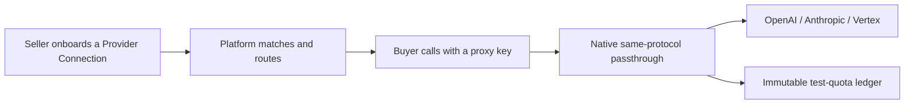

<p align="center">
  
</p>

<h1 align="center">TokenMarket</h1>

<p align="center">
  <strong>Make idle AI Coding Plan quota liquid.</strong>
</p>

<p align="center">
  Sellers onboard existing Provider Connections; buyers call through a platform-issued proxy key.
</p>

<p align="center">
  <a href="https://github.com/liuzeyu4201/TokenMarket/actions/workflows/ci.yml"></a>
  <a href="./LICENSE"></a>
  
  
</p>

<p align="center">
  <a href="README.md">中文</a> | <strong>English</strong>
</p>

TokenMarket is a **real-time matching and proxy platform for AI Coding Plan quota**. Sellers connect upstream credentials they already have; buyers never hold those credentials and call through a platform-issued proxy key. The data plane is native same-protocol passthrough for OpenAI, Anthropic, and Google Vertex — `/openai/*`, `/anthropic/*`, `/vertex/*` — with no cross-protocol conversion.

This repository is the **monorepo** that implements that product. The implemented baseline is the **V0.2 trading sandbox**: real users, full platform flows, native data-plane coverage, and an immutable test-quota ledger. There is **no recharge/payment/Escrow/withdraw**. Public launch still requires external evidence (independent pentest, paid vendor smoke, real SMS, production deploy). See [`specs/053-release-gates`](specs/053-release-gates/).

The goal is simple: idle quota should move, buyers should call native APIs, and the ledger should be reconcilable.



## Contents

- [Why this exists](#why-this-exists)
- [What you can do now](#what-you-can-do-now)
- [Architecture](#architecture)
- [Quick start](#quick-start)
- [Repository layout](#repository-layout)
- [Public commands](#public-commands)
- [Documentation](#documentation)
- [Security](#security)
- [License](#license)

## Why this exists

- Coding Plan quota is routinely wasted by rolling windows and month-end resets; sellers need a compliant outlet.
- Buyers need each vendor's native data plane, not another cross-protocol translation layer.
- Upstream credentials must not appear in the buyer UI, admin UI, logs, or telemetry.
- Shared traffic is scored on health, latency, capacity, and price; dedicated bindings stay exclusive and fail closed.
- Cost must be reproducible: prefer explicit upstream spend, otherwise usage × versioned rates; if it cannot be determined, record `unresolved` — never 0.

## What you can do now

**In place (V0.2 as-built)**

- **One-command local lifecycle**: PostgreSQL 15, Redis 7, Grafana OSS, plus five host processes
- **Unified login**: phone OTP, `__Host-` session cookie, buyer/seller workspace switch, self-trade isolation
- **Buyer Projects**: shared or dedicated, mode immutable after create; Provider Bindings; encrypted Provider Connections
- **Native data plane**: `/openai/*`, `/anthropic/*`, `/vertex/*` (freeze-day stable endpoints; Preview/Beta requires Project opt-in)
- **Routing**: shared pool hard-qualifies first, then scores health/latency/capacity/price; dedicated exclusive connection, fail-closed, no shared fallback
- **Test-quota ledger**: prefer explicit upstream spend, else usage × versioned rates; undetermined cost → `unresolved`
- **Ops surface**: isolated admin session and console; observability, SLO alerts, capacity and recovery drills
- **Layered deploy**: `make deploy mode=test|prod`

**Out of V0.2**

- Recharge, real payment, Escrow, fiat peg, withdraw, quota transfer
- Cross-protocol conversion; new-api as the core allocation layer
- Vendor control-plane (account / org / IAM / payment / credential management)
- Kafka in local `make dev`; business services inside `compose.local.yml`

Product intent: [`项目开发/V0.2/V0.2_0831/README.md`](项目开发/V0.2/V0.2_0831/README.md). Feature specs: [`specs/`](specs/) (V0.1 `001`–`019`, V0.2 `020`–`053`).

## Architecture

```text
  Browser / native SDK
           │
           ├─ UI ──────────────────────────────► frontend :5173
           │                                      │ /api/v1 (session)
           │                                      ▼
           │                               api-service :8000
           │                               auth · Project · Binding
           │                               Connection · proxy keys
           │
           ├─ /openai/*  /anthropic/*  /vertex/*
           └─ POST /v1/proxy/volcano/chat/completions   (V0.1 compat)
                                              │
                                       proxy-gateway :8080
                                       auth · catalog admit · route · meter
                                              │
                         ┌────────────────────┼────────────────────┐
                         ▼                    ▼                    ▼
                  billing-service      admin-service         OpenAI / Anthropic / Vertex
                  :8001 ledger·quote   :8002 admin session   (native protocol)
                         │
              PostgreSQL · Redis · Grafana :3000
```

- **proxy-gateway** (Go / Gin): sole data-plane ingress; no user table, no plaintext upstream credentials.
- **api-service** (Python / FastAPI): users, Projects, Bindings, Connections, proxy keys; first migration owner.
- **billing-service** (Python / FastAPI): test-quota ledger, quotes, recon; second migration owner.
- **admin-service** (Python / FastAPI): isolated admin identity and ops surface; no business-schema ownership.
- **frontend** (React / Vite): buyer/seller workspace plus `/admin`.
- **shared/contracts**: versioned HTTP / event / workflow contracts, defined before consumers.

Boundaries: [`docs/architecture/`](docs/architecture/README.en.md). Highest engineering constraint: the [constitution](.specify/memory/constitution.md).

## Quick start

Toolchain pins are in [`.tool-versions`](.tool-versions): Go 1.25.14, Python 3.11.15, Node 24.18.0, uv 0.11.3. Middleware needs a local Docker daemon.

```bash
make toolchain-check
make bootstrap
cp .env.example .env.local   # replace the three placeholders with distinct synthetic secrets
make start
make migrate
```

Day-to-day after that:

```bash
make start
make stop
```

First-time passwords, ports, and recovery: [`QUICKSTART.en.md`](QUICKSTART.en.md). Once the stack is up, the typical path is:

1. Open http://127.0.0.1:5173 and register or log in with phone OTP
2. As a buyer, create a Project (shared or dedicated) and issue a proxy key
3. As a seller, onboard and verify a Provider Connection
4. Call `/openai/*`, `/anthropic/*`, or `/vertex/*` with a native SDK
5. Read the test-quota ledger; undetermined cost is `unresolved`, never recorded as 0

Verify:

```bash
curl -fsS http://127.0.0.1:8080/health/live
curl -fsS http://127.0.0.1:8000/health/ready
```

| Surface | URL |
|---------|-----|
| Frontend | http://127.0.0.1:5173 |
| Register / login / Projects | `/register` · `/login` · `/projects` |
| Admin login | `/admin/login` |
| Gateway liveness | http://127.0.0.1:8080/health/live |
| API readiness | http://127.0.0.1:8000/health/ready |
| Grafana | http://127.0.0.1:3000 |
| Native data plane | `/openai/*` · `/anthropic/*` · `/vertex/*` |
| V0.1 Volcano compat | `POST /v1/proxy/volcano/chat/completions` |

Application processes run on the host. They **never** join `infra/docker/compose.local.yml`.

## Repository layout

```text
.
├── assets                   # README hero and other display assets
├── services/proxy-gateway   # Go gateway: native passthrough, catalog, routing
├── services/api-service     # users / Project / Binding / Connection / keys, migration order 1
├── services/billing-service # test-quota ledger and quotes, migration order 2
├── services/admin-service   # isolated admin session and ops surface
├── frontend                 # React app (buyer/seller + /admin)
├── shared/contracts         # versioned contracts (canonical, machine-readable)
├── infra                    # Compose, Grafana, image assets
├── ops                      # runbooks, alerts, migration ownership
├── tools/workflow           # workflow CLI behind the root Makefile
├── tests/workflow           # root workflow contract tests
├── specs                    # Spec Kit features and evidence
├── docs                     # documentation hub (catalog + ADRs)
├── 产品调研                 # market, competitors, business plan (canonical)
└── 项目开发                 # PRD, roadmap, V0.2 outline (canonical)
```

## Public commands

The root [`Makefile`](Makefile) is the only public entry. `make help` prints purpose, side effects, and recovery.

| Command | Purpose |
|---------|---------|
| `make start` / `make stop` | **Local default**: middleware + five host processes; reloads `.env.local` every start |
| `make dev` / `make dev-down` | PostgreSQL / Redis / Grafana only |
| `make start scope=apps` | App processes only when middleware is already up |
| `make deploy` / `make deploy-down` | Test/prod full stack; `mode=test\|prod` required |
| `make fmt` / `make lint` / `make test` | Format, static analysis, all tests |
| `make build` | Five service images and three deterministic asset bundles |
| `make migrate` | Reviewed Alembic migrations in owner order |
| `make ci` | Same sequence as GitHub Actions `quality-gate` |
| `make bootstrap` / `make type-check` | Locked dependencies; standalone type-check |

Layers: local = host apps + middleware; test/prod = `make build` then `make deploy mode=…`. Environment is **never** inferred from the Git branch name.

`.github/workflows/ci.yml` only invokes `make ci`. Project logic stays in the Makefile and `tools/workflow/`.

## Documentation

Catalog and language rules: [`docs/README.en.md`](docs/README.en.md) · [中文](docs/README.md)

| Reader | Start here |
|--------|------------|
| First run | [QUICKSTART.en.md](QUICKSTART.en.md) · [中文](QUICKSTART.md) |
| Change code, open a PR | [CONTRIBUTING.en.md](CONTRIBUTING.en.md) · [中文](CONTRIBUTING.md) |
| Architecture and ADRs | [docs/architecture](docs/architecture/README.en.md) · [docs/decisions](docs/decisions/README.en.md) |
| HTTP contracts | [docs/api](docs/api/README.en.md) → [`shared/contracts/`](shared/contracts/README.md) |
| Product and research | [docs/product](docs/product/README.en.md) |
| Local / deploy recovery | [ops/runbooks](ops/runbooks/README.md) |
| Report a security issue | [SECURITY.md](SECURITY.md) |

## Security

- Real config lives only in ignored `.env.local`; [`.env.example`](.env.example) holds unusable placeholders.
- Provider Connection credentials use authenticated encryption; UI, admin, logs, and telemetry must not read plaintext back.
- gitleaks, govulncheck, pip-audit, and npm audit **fail closed**.
- Production actions require explicit `mode=prod` and independent approval.

Details: [SECURITY.md](SECURITY.md) and [`ops/runbooks/workflow.md`](ops/runbooks/workflow.md).

## License

This repository is licensed under the [Apache License 2.0](LICENSE). Copyright and attribution are in [NOTICE](NOTICE).
