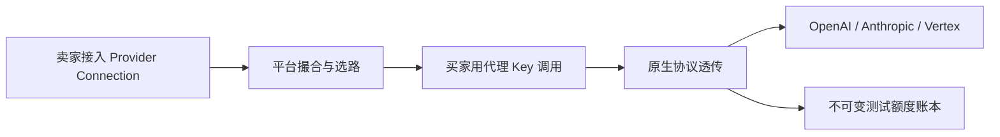

<p align="center">
  
</p>

<h1 align="center">TokenMarket</h1>

<p align="center">
  <strong>让 AI Coding Plan 的闲置额度流动起来。</strong>
</p>

<p align="center">
  卖家接入已有 Provider Connection，买家用平台签发的代理 Key 按量调用。
</p>

<p align="center">
  <a href="https://github.com/liuzeyu4201/TokenMarket/actions/workflows/ci.yml"></a>
  <a href="./LICENSE"></a>
  
  
</p>

<p align="center">
  <strong>中文</strong> | <a href="README.en.md">English</a>
</p>

TokenMarket 是 **AI Coding Plan 额度的实时撮合与代理平台**。卖家把已有的上游连接接入平台；买家不直接持有上游凭据，只用平台签发的代理 Key，按 OpenAI、Anthropic、Google Vertex 各自的原生协议调用。数据面走 `/openai/*`、`/anthropic/*`、`/vertex/*`，同协议透传，不做跨协议转换。

本仓库是实现该产品的 **monorepo**。当前实现基线是 **V0.2 交易沙盒**：真实用户、完整平台流程、原生数据面与不可变测试额度账本。**无充值/支付/Escrow/提现**。公开上线仍须独立渗透、付费厂商冒烟、真实短信与生产部署等外部证据（见 [`specs/053-release-gates`](specs/053-release-gates/)）。

目标很简单：闲置额度可以流动，买家按原生协议调用，账本可以对账。



## 目录

- [为什么做](#为什么做)
- [现在能做什么](#现在能做什么)
- [架构](#架构)
- [快速开始](#快速开始)
- [仓库结构](#仓库结构)
- [公开命令](#公开命令)
- [文档](#文档)
- [安全](#安全)
- [许可](#许可)

## 为什么做

- Coding Plan 额度常被窗口和月底清零浪费，卖家需要一个合规的出口。
- 买家要的是厂商原生数据面，而不是再包一层跨协议转换。
- 上游凭据不能出现在买家、管理员、日志或遥测里。
- 共享流量按健康、延迟、容量和价格选路；专享必须隔离，故障失败关闭。
- 费用必须可复算：优先上游花费，否则用量 × 版本化费率；算不清就记 `unresolved`，永不记 0。

## 现在能做什么

**已具备（V0.2 as-built）**

- **一键本地起停**：PostgreSQL 15、Redis 7、Grafana OSS，加上五个主机进程
- **统一登录**：手机号 OTP、`__Host-` 会话 Cookie、买家/卖家工作区切换、自买自卖隔离
- **买家 Project**：共享或专享，创建后模式不可改；Provider Binding、加密 Provider Connection
- **原生数据面**：`/openai/*`、`/anthropic/*`、`/vertex/*`（冻结日稳定端点；Preview/Beta 须 Project opt-in）
- **选路**：共享池先做硬资格过滤，再按健康、延迟、容量、价格评分；专享独占连接，故障失败关闭、不回退共享池
- **测试额度账本**：优先上游明确花费，否则用量 × 版本化费率；无法确定则 `unresolved`
- **运维面**：独立管理员会话与后台；可观测性、SLO 告警、容量与恢复演练
- **分层部署**：`make deploy mode=test|prod`

**V0.2 不做**

- 充值、真实支付、Escrow、法币锚定、提现、额度转让
- 跨协议转换；把 new-api 当作核心分配层
- 账号 / 组织 / IAM / 支付 / 上游凭据管理等厂商控制面
- Kafka 纳入本地 `make dev`；业务服务写入 `compose.local.yml`

产品意图见 [`项目开发/V0.2/V0.2_0831/README.md`](项目开发/V0.2/V0.2_0831/README.md)。功能规格在 [`specs/`](specs/)（V0.1 为 `001`–`019`，V0.2 为 `020`–`053`）。

## 架构

```text
  浏览器 / 原生 SDK
           │
           ├─ UI ──────────────────────────────► frontend :5173
           │                                      │ /api/v1（会话）
           │                                      ▼
           │                               api-service :8000
           │                               认证 · Project · Binding
           │                               Connection · 代理 Key
           │
           ├─ /openai/*  /anthropic/*  /vertex/*
           └─ POST /v1/proxy/volcano/chat/completions   （V0.1 兼容入口）
                                              │
                                       proxy-gateway :8080
                                       鉴权 · 目录准入 · 选路上游 · 计量
                                              │
                         ┌────────────────────┼────────────────────┐
                         ▼                    ▼                    ▼
                  billing-service      admin-service         OpenAI / Anthropic / Vertex
                  :8001 账本·报价      :8002 独立管理会话     （原生同协议）
                         │
              PostgreSQL · Redis · Grafana :3000
```

- **proxy-gateway**（Go / Gin）：数据面唯一入口；无用户表、无明文上游凭据。
- **api-service**（Python / FastAPI）：用户、Project、Binding、Connection、代理 Key；第一迁移所有者。
- **billing-service**（Python / FastAPI）：测试额度账本、报价、对账；第二迁移所有者。
- **admin-service**（Python / FastAPI）：独立管理员身份与运维面；无业务库所有权。
- **frontend**（React / Vite）：买家/卖家工作区 + `/admin` 后台。
- **shared/contracts**：HTTP / 事件 / 工作流版本化契约，先于消费者。

边界与数据流见 [`docs/architecture/`](docs/architecture/README.md)。工程最高约束是 [宪章](.specify/memory/constitution.md)。

## 快速开始

工具版本见 [`.tool-versions`](.tool-versions)：Go 1.25.14、Python 3.11.15、Node 24.18.0、uv 0.11.3。中间件需要本机 Docker。

```bash
make toolchain-check
make bootstrap
cp .env.example .env.local   # 将三个占位符换成独立合成密码
make start
make migrate
```

之后日常只需要：

```bash
make start
make stop
```

第一次配密码、端口、恢复码见 [`QUICKSTART.md`](QUICKSTART.md)。本地跑起来之后，典型路径是：

1. 打开 http://127.0.0.1:5173 ，用手机号 OTP 注册或登录
2. 买家创建 Project（共享或专享），签发代理 Key
3. 卖家接入并验证 Provider Connection
4. 用原生 SDK 调用 `/openai/*`、`/anthropic/*` 或 `/vertex/*`
5. 在账本里看到测试额度；算不清的费用是 `unresolved`，不会被记成 0

验证：

```bash
curl -fsS http://127.0.0.1:8080/health/live
curl -fsS http://127.0.0.1:8000/health/ready
```

| 用途 | 地址 |
|------|------|
| 前端 | http://127.0.0.1:5173 |
| 注册 / 登录 / Project | `/register` · `/login` · `/projects` |
| 管理员登录 | `/admin/login` |
| 网关健康 | http://127.0.0.1:8080/health/live |
| API 就绪 | http://127.0.0.1:8000/health/ready |
| Grafana | http://127.0.0.1:3000 |
| 原生数据面 | `/openai/*` · `/anthropic/*` · `/vertex/*` |
| V0.1 火山兼容入口 | `POST /v1/proxy/volcano/chat/completions` |

业务进程跑在本机，**不**进入 `infra/docker/compose.local.yml`。

## 仓库结构

```text
.
├── assets                   # README 英雄图等展示资产
├── services/proxy-gateway   # Go 网关：原生透传、目录准入、选路
├── services/api-service     # 用户 / Project / Binding / Connection / Key，迁移顺序 1
├── services/billing-service # 测试额度账本与报价，迁移顺序 2
├── services/admin-service   # 独立管理员会话与运维面
├── frontend                 # React 前端（买家/卖家 + /admin）
├── shared/contracts         # 版本化契约（机器可读，权威）
├── infra                    # Compose、Grafana、镜像资产
├── ops                      # 运行手册、告警、迁移所有权
├── tools/workflow           # 根 Makefile 背后的工作流 CLI
├── tests/workflow           # 根级工作流契约测试
├── specs                    # Spec Kit 功能规格与验收证据
├── docs                     # 文档枢纽（分类索引 + ADR）
├── 产品调研                 # 市场、竞品、商业计划（权威原文）
└── 项目开发                 # PRD、路线图、V0.2 总纲（权威原文）
```

## 公开命令

根 [`Makefile`](Makefile) 是唯一公共入口。`make help` 列出用途、副作用与恢复。

| 命令 | 用途 |
|------|------|
| `make start` / `make stop` | **本地默认**：中间件 + 五个主机进程；每次启动重读 `.env.local` |
| `make dev` / `make dev-down` | 只管理 PostgreSQL / Redis / Grafana |
| `make start scope=apps` | 中间件已就绪时只操作应用进程 |
| `make deploy` / `make deploy-down` | 测试/生产全栈；必须 `mode=test\|prod` |
| `make fmt` / `make lint` / `make test` | 格式化、静态检查、全部测试 |
| `make build` | 五个服务镜像与三个确定性资产包 |
| `make migrate` | 按所有者顺序执行已评审 Alembic 迁移 |
| `make ci` | 与 GitHub Actions `quality-gate` 相同的完整顺序 |
| `make bootstrap` / `make type-check` | 准备已提交锁的依赖；独立类型检查 |

分层：本地 = 主机应用 + 中间件；测试/生产 = `make build` 后 `make deploy mode=…`。环境**不**从 Git 分支名推断。

`.github/workflows/ci.yml` 只调用 `make ci`。项目逻辑留在 Makefile 与 `tools/workflow/`。

## 文档

分类地图与语言约定：[`docs/README.md`](docs/README.md) · [English](docs/README.en.md)

| 读者 | 从这里开始 |
|------|------------|
| 第一次跑起来 | [QUICKSTART.md](QUICKSTART.md) · [English](QUICKSTART.en.md) |
| 改代码、开 PR | [CONTRIBUTING.md](CONTRIBUTING.md) · [English](CONTRIBUTING.en.md) |
| 看架构与 ADR | [docs/architecture](docs/architecture/README.md) · [docs/decisions](docs/decisions/README.md) |
| 查 HTTP 契约 | [docs/api](docs/api/README.md) → [`shared/contracts/`](shared/contracts/README.md) |
| 产品与调研 | [docs/product](docs/product/README.md) |
| 本地/部署排障 | [ops/runbooks](ops/runbooks/README.md) |
| 报告安全问题 | [SECURITY.md](SECURITY.md) |

## 安全

- 真实配置只存在于被忽略的 `.env.local`；[`.env.example`](.env.example) 仅含不可用占位符。
- Provider Connection 凭据认证加密；UI、管理员、日志与遥测不得回读明文。
- gitleaks、govulncheck、pip-audit、npm audit **失败关闭**。
- 生产动作必须显式 `mode=prod` 并经独立审批。

细则见 [SECURITY.md](SECURITY.md) 与 [`ops/runbooks/workflow.md`](ops/runbooks/workflow.md)。

## 许可

本仓库以 [Apache License 2.0](LICENSE) 授权。版权与归属见 [NOTICE](NOTICE)。
