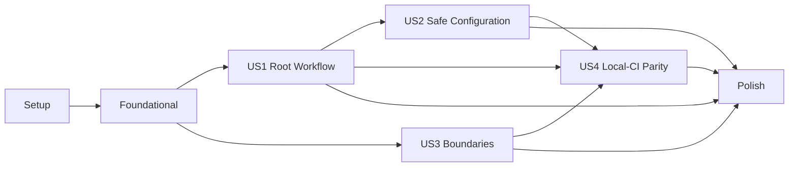

# Tasks: 仓库工程工作流基线

**Input**: Design documents from `/specs/001-repository-workflow-baseline/`

**Prerequisites**: `plan.md`, `spec.md`, `research.md`, `data-model.md`, `contracts/`, `quickstart.md`

**Tests**: 本功能改变仓库工作流、服务运行骨架、迁移和持续集成行为。依据规格与工程宪章，所有行为任务必须先编写会失败的自动化测试，再实现对应行为。

**Organization**: 任务按用户故事组织。Setup 和 Foundational 只放置项目初始化、契约事实源与测试支撑；故事阶段内保持“测试先行 → 实现 → 独立验收”的顺序。

## Format: `[ID] [P?] [Story] Description`

- **[P]**: 可在同一阶段内并行执行，涉及不同文件且不依赖尚未完成的同阶段任务
- **[Story]**: `US1`–`US4`，对应 `spec.md` 中的用户故事
- 每个任务均给出明确仓库相对路径；行为测试必须先观察到预期失败再进入实现任务

## Requirements Traceability（实施入口门禁）

本表在任何实现任务开始前生效，是 FR/ER/SC 到任务和测试证据的当前映射；T102 只负责在实现完成后复核和补充实际证据，不得把首次追踪推迟到 Polish 阶段。

| Requirement | Primary task and test evidence |
|-------------|--------------------------------|
| FR-001 | T012, T069, T073, T075, T082 |
| FR-002 | T012, T069, T071, T073, T075, T080 |
| FR-003 | T015, T033, T035, T038, T042, T046, T049, T055 |
| FR-004 | T015, T033, T087, T097 |
| FR-005 | T015–T017, T031–T033, T055 |
| FR-006 | T016, T021–T055 |
| FR-007 | T018, T032, T033 |
| FR-008 | T019, T033, T055 |
| FR-009 | T015, T019, T033 |
| FR-010 | T016, T033, T035, T038, T042, T046, T049, T051–T053 |
| FR-011 | T015, T035, T038, T042, T046, T049, T075, T094 |
| FR-012 | T084, T093, T104 |
| FR-013 | T029, T036, T040, T044, T047, T050–T053, T089, T108 |
| FR-014 | T014, T020, T039, T043, T054, T085, T090, T091, T094, T095 |
| FR-015 | T056, T061 |
| FR-016 | T056, T062, T068 |
| FR-017 | T058, T059, T063–T066, T106 |
| FR-018 | T001–T008, T013, T018, T033, T060, T095 |
| FR-019 | T010–T012, T026, T070, T074, T076, T079 |
| FR-020 | T073, T097, T105 |
| FR-021 | T012, T031–T033, T072, T075 |
| FR-022 | T083, T092, T100 |
| FR-023 | T084, T086, T093, T100 |
| FR-024 | T009, T072, T081, T107 |
| FR-025 | T020, T088, T094–T100, T108 |
| FR-026 | T020, T054, T085, T090, T091, T100 |
| ER-001 | T010, T015, T033, T070, T076, T088, T101 |
| ER-002 | T056–T068, T106 |
| ER-003 | T014, T020, T039, T043, T054, T094, T095 |
| ER-004 | T018, T087, T104 |
| ER-005 | T017, T084, T086, T089, T104, T108 |
| ER-006 | T017, T021–T024, T030, T055 |
| ER-007 | T025, T087, T097 |
| SC-001 | T087, T097, T105 |
| SC-002 | T015–T018, T032, T033, T055, T057 |
| SC-003 | T084, T086, T089, T104, T108 |
| SC-004 | T020, T088, T094, T095, T099, T100, T108 |
| SC-005 | T056–T068, T106 |
| SC-006 | T069–T076, T082 |
| SC-007 | T083, T087, T092, T100 |
| SC-008 | T015, T019, T033, T084, T093 |
| SC-009 | T016, T021–T055, T108 |
| SC-010 | T084, T093, T100, T104 |
| SC-011 | T020, T054, T085, T090, T091, T100 |
| SC-012 | T019, T033, T055 |

## Phase 1: Setup（项目初始化）

**Purpose**: 固定语言与依赖基线，建立各组件可独立安装的最小工程元数据；本阶段不实现工作流或服务行为。

- [ ] T001 在 `.tool-versions` 固定 Go `1.25.12`、Python `3.11.15`、Node `24.18.0` 与仓库采用的 uv/npm 版本
- [ ] T002 [P] 在 `tools/workflow/__init__.py`、`tools/workflow/pyproject.toml`、`tools/workflow/uv.lock` 与 `tests/workflow/__init__.py` 初始化独立锁定的仓库工作流包、pytest、Black、isort、flake8 和 mypy 环境
- [ ] T003 [P] 在 `services/proxy-gateway/go.mod` 与 `services/proxy-gateway/go.sum` 初始化独立 Go 模块并锁定 Gin、Prometheus 依赖
- [ ] T004 [P] 在 `services/api-service/pyproject.toml` 与 `services/api-service/uv.lock` 初始化 API 服务并锁定 FastAPI、Pydantic、Uvicorn、Prometheus、Alembic 和测试/质量工具
- [ ] T005 [P] 在 `services/billing-service/pyproject.toml` 与 `services/billing-service/uv.lock` 初始化 Billing 服务并锁定与独立构建相符的依赖
- [ ] T006 [P] 在 `services/admin-service/pyproject.toml` 与 `services/admin-service/uv.lock` 初始化 Admin 服务并锁定与独立构建相符的依赖
- [ ] T007 [P] 在 `frontend/package.json` 与 `frontend/package-lock.json` 初始化 React 18、Vite、strict TypeScript、Vitest、Testing Library、ESLint 和 Prettier 依赖
- [ ] T008 [P] 在 `services/proxy-gateway/.golangci.yml`、`frontend/tsconfig.json`、`frontend/eslint.config.js`、`frontend/.prettierrc`、`frontend/vite.config.ts` 与 `frontend/vitest.config.ts` 固定组件质量配置

---

## Phase 2: Foundational（阻塞性事实源与测试支撑）

**Purpose**: 先建立隔离测试支撑和缺失事实源的失败测试，再生成所有故事共享的版本化契约及组件/工具链/迁移事实源。

**Critical**: 本阶段完成前不得开始用户故事实现；这些文件是后续测试和工作流读取的唯一事实源。

- [ ] T009 [P] 在 `docs/decisions/001-github-actions-ci-adapter.md` 记录 GitHub Actions 薄适配层的所有权、权限、失败模式、替换边界与回退方案
- [ ] T010 在 `tests/workflow/helpers.py`、`tests/workflow/test_foundational_contracts.py` 与 `tests/workflow/fixtures/README.md` 建立隔离仓库/副作用快照支撑，先编写运行时契约副本、组件清单、工具链清单或迁移所有者清单缺失/非法时失败的测试，并运行确认它们因目标事实文件尚不存在而失败
- [ ] T011 [P] 将已评审的工作流事件、组件清单、迁移清单和健康接口契约落地到 `shared/contracts/repository-workflow/v1/`，并保持其与 `specs/001-repository-workflow-baseline/contracts/` 的来源映射，使 T010 的契约副本测试通过
- [ ] T012 [P] 在 `ops/workflow/components.json` 定义八个必需组件、所有者、允许依赖、测试根、交付物及 `bootstrap/fmt/fmt-check/type-check/lint/test/build/migrate` 适用动作绑定，使 T010 的组件清单测试通过
- [ ] T013 [P] 在 `ops/workflow/toolchains.json` 记录 `.tool-versions`、四个 Python/前端/Go 锁文件集合、扫描器、Actions、PostgreSQL 15 与基础镜像的精确版本和完整性来源，使 T010 的工具链清单测试通过
- [ ] T014 [P] 在 `ops/migrations/owners.json` 定义 `api-service`、`billing-service` 的唯一顺序与 backout 路径并明确 `admin-service` 为非所有者，使 T010 的迁移所有者测试通过

**Checkpoint**: 契约和事实源可被测试读取，所有用户故事可以按下述依赖开始。

---

## Phase 3: User Story 1 — 从仓库根目录完成日常工程动作（Priority: P1）🎯

**Goal**: 通过根 Makefile 的稳定入口聚合八个组件的真实格式化、检查、测试、构建和迁移；SF02 前的 `dev/dev-down` 明确失败且零副作用。

**Independent Test**: 在全新检出中仅使用 `make help`，依次验证 `fmt`、`lint`、`test`、`build` 成功，`migrate` 按声明所有者执行或安全报告本地依赖缺失，`dev/dev-down` 以 `SF02_NOT_READY` 无副作用失败；注入任一组件失败、空适配器或零测试时聚合动作必须失败。

### Tests for User Story 1（先编写并确认失败）

- [ ] T015 [P] [US1] 在 `tests/workflow/test_command_contract.py` 编写七个公开目标、稳定 `bootstrap/type-check` 支撑目标、帮助字段、副作用、退出语义、适用组件和 fail-fast 聚合契约测试
- [ ] T016 [P] [US1] 在 `tests/workflow/test_component_manifest.py` 编写八组件完整性、适用 `bootstrap/type-check` 与其他必需动作绑定、空适配器、未初始化组件和零测试证据的负向测试
- [ ] T017 [P] [US1] 在 `tests/workflow/test_events.py` 编写 JSONL schema、步骤顺序、失败后 `SKIPPED`、最终状态及稳定诊断码测试
- [ ] T018 [P] [US1] 在 `tests/workflow/test_toolchains.py` 编写缺失工具、不支持版本、锁文件/完整性引用缺失均在 5 秒内失败，以及连续两次 frozen bootstrap 不改锁或依赖解析的测试
- [ ] T019 [P] [US1] 在 `tests/workflow/test_sf02_transition.py` 编写 `dev/dev-down` 返回 `SF02_NOT_READY` 且不读取配置、不检查 Docker、不改变资源或工作区的测试
- [ ] T020 [P] [US1] 在 `tests/workflow/test_migrations.py` 编写离线所有者/单 head/backout 负向测试，并用 `ops/workflow/toolchains.json` 固定 digest 的 PostgreSQL 15 容器编写 API→Billing forward、backout、retry、最终 head 恢复及禁止调用 `make dev`/共享数据库的失败测试
- [ ] T021 [P] [US1] 在 `services/proxy-gateway/internal/httpserver/server_test.go` 编写 liveness、readiness、metrics、request ID、未知业务路径 404 和日志脱敏测试
- [ ] T022 [P] [US1] 在 `services/api-service/tests/test_health.py` 编写 API 服务 live/ready/metrics、request ID、无 SF02 依赖和未知业务路径 404 测试
- [ ] T023 [P] [US1] 在 `services/billing-service/tests/test_health.py` 编写 Billing 服务 live/ready/metrics、request ID、无 SF02 依赖和未知业务路径 404 测试
- [ ] T024 [P] [US1] 在 `services/admin-service/tests/test_health.py` 编写 Admin 服务 live/ready/metrics、request ID、无迁移所有权和未知业务路径 404 测试
- [ ] T025 [P] [US1] 在 `frontend/src/App.test.tsx` 编写最小可访问页面、版本信息、无业务交互和安全渲染 smoke test
- [ ] T026 [P] [US1] 在 `shared/tests/test_contract_assets.py` 编写 schema 解析、负向 fixture、来源映射和确定性契约资产包测试
- [ ] T027 [P] [US1] 在 `infra/tests/test_infra_assets.py` 编写必需基础设施说明、禁止提前实现 SF02 编排和确定性资产包测试
- [ ] T028 [P] [US1] 在 `ops/tests/test_ops_assets.py` 编写迁移/监控/备份/runbook 资产完整性、负向 fixture 和确定性资产包测试
- [ ] T029 [P] [US1] 在 `tests/workflow/test_images.py` 编写五个镜像独立上下文、多阶段构建、非 root、健康检查、不可变标签和运行时 health smoke 契约测试

### Implementation for User Story 1

- [ ] T030 [P] [US1] 在 `tools/workflow/events.py` 实现 schema 1.0.0 JSONL 事件、纯文本状态、耗时、失败/跳过语义和序列化前脱敏
- [ ] T031 [P] [US1] 在 `tools/workflow/manifest.py` 实现 `ops/workflow/components.json` 的加载、schema 校验、仓库内路径解析、动作绑定与最低证据校验
- [ ] T032 [US1] 在 `tools/workflow/cli.py` 实现动作解析、工具链预检、frozen bootstrap、清单顺序执行、fail-fast、安全重试提示和最终聚合状态
- [ ] T033 [US1] 在根 `Makefile` 实现 `help/dev/dev-down/fmt/lint/test/build/migrate` 公开入口与稳定 `bootstrap/type-check/toolchain-check` 支撑入口；bootstrap 只准备锁定项目依赖，所有项目逻辑委托给受控工作流/组件适配器
- [ ] T034 [P] [US1] 在 `services/proxy-gateway/cmd/gateway/main.go`、`services/proxy-gateway/internal/httpserver/server.go` 与 `services/proxy-gateway/internal/observability/observability.go` 实现无业务路由的 Go 运行骨架
- [ ] T035 [US1] 在 `services/proxy-gateway/Makefile` 实现 locked `bootstrap`、`fmt/fmt-check`、`type-check`、`lint`、`test -race`/coverage 与 `build` 内部适配器并报告证据
- [ ] T036 [US1] 在 `services/proxy-gateway/Dockerfile` 与 `services/proxy-gateway/.dockerignore` 实现固定 digest、多阶段、非 root、有健康检查且不复制仓库外内容的镜像
- [ ] T037 [P] [US1] 在 `services/api-service/app/main.py`、`services/api-service/app/health.py` 与 `services/api-service/app/observability.py` 实现 API 服务无业务路由运行骨架
- [ ] T038 [US1] 在 `services/api-service/Makefile` 实现 frozen `bootstrap` 及 Black/isort、mypy、flake8、pytest/coverage、build、migrate 内部适配器，并暴露独立 `type-check`
- [ ] T039 [P] [US1] 在 `services/api-service/alembic.ini`、`services/api-service/alembic/env.py` 与 `services/api-service/alembic/versions/0001_baseline.py` 初始化无业务表、可 upgrade/downgrade 的单 head 迁移图
- [ ] T040 [US1] 在 `services/api-service/Dockerfile` 与 `services/api-service/.dockerignore` 实现固定 digest、多阶段、非 root、有健康检查且不复制 `.env.*` 的镜像
- [ ] T041 [P] [US1] 在 `services/billing-service/app/main.py`、`services/billing-service/app/health.py` 与 `services/billing-service/app/observability.py` 实现 Billing 服务无业务路由运行骨架
- [ ] T042 [US1] 在 `services/billing-service/Makefile` 实现 frozen `bootstrap` 及 Black/isort、mypy、flake8、pytest/coverage、build、migrate 内部适配器，并暴露独立 `type-check`
- [ ] T043 [P] [US1] 在 `services/billing-service/alembic.ini`、`services/billing-service/alembic/env.py` 与 `services/billing-service/alembic/versions/0001_baseline.py` 初始化无业务表、可 upgrade/downgrade 的单 head 迁移图
- [ ] T044 [US1] 在 `services/billing-service/Dockerfile` 与 `services/billing-service/.dockerignore` 实现固定 digest、多阶段、非 root、有健康检查且不复制 `.env.*` 的镜像
- [ ] T045 [P] [US1] 在 `services/admin-service/app/main.py`、`services/admin-service/app/health.py` 与 `services/admin-service/app/observability.py` 实现 Admin 服务无业务路由、无数据库连接的运行骨架
- [ ] T046 [US1] 在 `services/admin-service/Makefile` 实现 frozen `bootstrap` 及 Black/isort、mypy、flake8、pytest/coverage、build 内部适配器并暴露独立 `type-check`，且不提供迁移成功伪入口
- [ ] T047 [US1] 在 `services/admin-service/Dockerfile` 与 `services/admin-service/.dockerignore` 实现固定 digest、多阶段、非 root、有健康检查且不复制 `.env.*` 的镜像
- [ ] T048 [P] [US1] 在 `frontend/index.html`、`frontend/src/main.tsx` 与 `frontend/src/App.tsx` 实现无业务功能的最小语义化可访问页面
- [ ] T049 [US1] 在 `frontend/Makefile` 实现 `npm ci` locked bootstrap、Prettier、`tsc --noEmit` type-check、ESLint、Vitest 与 build 内部适配器
- [ ] T050 [US1] 在 `frontend/Dockerfile`、`frontend/.dockerignore`、`frontend/nginx.conf` 实现固定 digest、多阶段、非 root、可健康探测的静态站点镜像
- [ ] T051 [P] [US1] 在 `shared/Makefile` 与 `shared/tools/validate_contracts.py` 复用仓库工具锁实现真实 bootstrap、格式/type/lint/测试及确定性 `shared` 契约资产包
- [ ] T052 [P] [US1] 在 `infra/Makefile` 与 `infra/tools/validate_assets.py` 复用仓库工具锁实现真实 bootstrap、格式/type/lint/测试及确定性 `infra` 资产包，禁止启动 SF02 资源
- [ ] T053 [P] [US1] 在 `ops/Makefile` 与 `ops/tools/validate_assets.py` 复用仓库工具锁实现真实 bootstrap、格式/type/lint/测试及确定性 `ops` 资产包
- [ ] T054 [US1] 在 `tools/workflow/migrations.py`、`tools/workflow/cli.py` 与根 `Makefile` 实现离线 `migrate-check`、消费已验证环境引用的 API→Billing migrate 执行器，以及固定 PostgreSQL 15 合成容器的 `migrate-integration-check` forward/backout/retry/head-restore
- [ ] T055 [US1] 执行 US1 独立验收并把帮助、两次 frozen bootstrap、独立 type-check、八组件步骤/测试计数、PG15 迁移往返、五镜像 smoke、三资产包摘要和 SF02 零副作用快照记录到 `specs/001-repository-workflow-baseline/checklists/us1-workflow-evidence.md`

**Checkpoint**: US1 可独立证明所有日常根级工程动作真实执行；任何必需步骤缺失或失败均不会被报告为通过。

---

## Phase 4: User Story 2 — 安全地准备本地配置（Priority: P1）

**Goal**: 提供完整但不可用的配置定义、真实环境文件忽略规则、值级脱敏和阻断式秘密/依赖扫描。

**Independent Test**: 从 `.env.example` 创建 `.env.local` 后验证其未进入 Git；缺失/非法配置在任何资源访问前只报告变量名；合成疑似凭证能被检查发现且输出不回显其值；正常示例、锁文件和构建产物不含有效秘密。

### Tests for User Story 2（先编写并确认失败）

- [ ] T056 [P] [US2] 在 `tests/workflow/test_configuration.py` 编写配置名称、类型、必需 mode、敏感级别、安全占位符及 `.env.*` 忽略规则测试
- [ ] T057 [P] [US2] 在 `tests/workflow/test_config_preflight.py` 编写缺失、空值、错误类型和危险生产默认值均在持久副作用前失败且只显示变量名的测试
- [ ] T058 [P] [US2] 在 `tests/workflow/test_redaction.py` 编写终端、JSONL、异常、服务日志、测试夹具和构建参数的秘密/个人数据脱敏测试
- [ ] T059 [P] [US2] 在 `tests/workflow/test_secret_scan.py` 运行时生成合成疑似凭证并验证全历史扫描失败、定位文件且不在输出中回显值
- [ ] T060 [P] [US2] 在 `tests/workflow/test_dependency_scans.py` 编写 Go、三个 Python 锁和 npm 锁均被扫描、扫描器失败关闭且最多有界重试一次的测试

### Implementation for User Story 2

- [ ] T061 [P] [US2] 在根 `.env.example` 定义 SF01 配置名称、用途、类型、必需环境、敏感级别和不可用安全占位符，不写入真实地址或凭证
- [ ] T062 [P] [US2] 在根 `.gitignore` 忽略 `.env`、`.env.*`、本地扫描/测试/构建输出，同时仅放行安全的 `*.example` 定义
- [ ] T063 [US2] 在 `tools/workflow/security.py` 实现配置元数据解析、类型/必需性验证、危险默认值检测及序列化前统一脱敏
- [ ] T064 [US2] 在 `tools/workflow/security.py` 实现固定版本 Gitleaks、govulncheck、pip-audit、npm audit 的失败关闭编排和有界下载重试
- [ ] T065 [US2] 在根 `Makefile` 接入 `security-check`，确保扫描覆盖 Git 历史、所有锁文件和合成正向 fixture，且任一必需扫描不可降级为 warning
- [ ] T066 [US2] 在 `services/proxy-gateway/Dockerfile`、`services/api-service/Dockerfile`、`services/billing-service/Dockerfile`、`services/admin-service/Dockerfile` 与 `frontend/Dockerfile` 禁止秘密 build args、真实配置复制和敏感构建层残留
- [ ] T067 [P] [US2] 在 `ops/runbooks/workflow.md` 编写本地合成配置、秘密发现后的撤销/轮换/审计流程及带 owner/approver/issue/expiry 的例外格式
- [ ] T068 [US2] 执行 US2 独立验收并把 Git 忽略、配置前检、脱敏、合成秘密和依赖扫描证据记录到 `specs/001-repository-workflow-baseline/checklists/us2-security-evidence.md`

**Checkpoint**: US2 可独立证明开发者能准备本地配置，同时秘密不会进入版本控制、日志、测试或构建产物。

---

## Phase 5: User Story 3 — 在明确的组件边界内开始开发（Priority: P2）

**Goal**: 让八个组件的职责、所有权、依赖、测试根和交付物可发现，并通过版本化契约与负向结构检查阻止越界。

**Independent Test**: 执行结构/契约检查验证八个边界与版本化契约均通过；在隔离 fixture 中删除目录、错放测试、加入跨服务内部依赖、无版本契约或缺失 ADR 时检查必须准确失败。

### Tests for User Story 3（先编写并确认失败）

- [ ] T069 [P] [US3] 在 `tests/workflow/test_structure.py` 编写缺失边界、路径逃逸、错误测试根、空 README 和交付物未声明的负向结构测试
- [ ] T070 [P] [US3] 在 `tests/workflow/test_contracts.py` 编写 schema、owner、语义版本、兼容/弃用字段、链接和规划源映射的契约测试
- [ ] T071 [P] [US3] 在 `tests/workflow/test_boundaries.py` 编写服务间内部 import、跨服务存储访问、shared 业务逻辑和 admin 迁移所有权的禁止规则测试
- [ ] T072 [P] [US3] 在 `tests/workflow/test_adr_policy.py` 编写新增服务、存储、协议、共享抽象或跨服务依赖但缺少完整 ADR 时失败的测试

### Implementation for User Story 3

- [ ] T073 [P] [US3] 在 `services/proxy-gateway/README.md`、`services/api-service/README.md`、`services/billing-service/README.md`、`services/admin-service/README.md`、`frontend/README.md`、`shared/README.md`、`infra/README.md` 与 `ops/README.md` 记录职责、owner、允许依赖、构建入口、测试根和禁止事项
- [ ] T074 [P] [US3] 在 `shared/contracts/README.md` 与 `shared/contracts/_meta/contract-manifest.schema.json` 定义契约 owner、版本、兼容性、弃用和可复现生成规则
- [ ] T075 [US3] 在 `tools/workflow/manifest.py` 实现八边界结构、symlink 仓库逃逸、测试位置、动作适配器、依赖方向和交付物的静态验证
- [ ] T076 [US3] 在 `shared/tools/validate_contracts.py` 与 `shared/Makefile` 实现 schema/链接/来源映射/版本兼容检查和生成物 drift 阻断
- [ ] T077 [P] [US3] 在 `infra/docker/README.md`、`infra/nginx/README.md`、`infra/grafana/README.md` 与 `infra/kafka/README.md` 记录基础设施资产边界及 SF02 才能实现的生命周期责任
- [ ] T078 [P] [US3] 在 `ops/migrations/README.md`、`ops/monitoring/README.md`、`ops/backup/README.md` 与 `ops/runbooks/migrations.md` 记录所有权、失败模式、监控、恢复和迁移 backout 责任
- [ ] T079 [P] [US3] 在 `docs/api/README.md` 记录 OpenAPI/event/schema 必须先于消费者实现、版本兼容与生成类型约束
- [ ] T080 [P] [US3] 在 `.github/CODEOWNERS` 为根工作流、八组件、共享契约、迁移、CI 和 ADR 配置可审计评审所有者
- [ ] T081 [P] [US3] 在 `docs/decisions/README.md` 提供包含所有权、失败模式、运维成本、迁移、回退和替代方案的 ADR 入口与审查规则
- [ ] T082 [US3] 执行 US3 独立验收并把正常结构、四类违规 fixture、契约 drift 和 ADR 门禁证据记录到 `specs/001-repository-workflow-baseline/checklists/us3-boundary-evidence.md`

**Checkpoint**: US3 可独立证明每类资产只有一个正确位置，越界、未版本化契约或缺失 ADR 会阻断检查。

---

## Phase 6: User Story 4 — 在本地与持续集成中获得相同结论（Priority: P2）

**Goal**: 让 dirty worktree、特殊路径、重复执行和 `mode=local|test|prod` 在本地安全可复现，并由只调用 `make ci` 的只读阻断式 CI 得出相同结论。

**Independent Test**: 对同一提交在本地和 GitHub Actions 执行 `make ci`，比较步骤与结果；在含空格/中文路径及预置未提交/未跟踪文件的隔离副本中验证非破坏性和重试一致性；验证省略 mode 仅为 local、test/prod 只能显式选择、prod 未批准在资源访问前失败。

### Tests for User Story 4（先编写并确认失败）

- [ ] T083 [P] [US4] 在 `tests/workflow/test_paths.py` 编写从任意工作目录及含空格/中文绝对路径解析仓库根、引用路径和禁止访问仓库外同名路径的测试
- [ ] T084 [P] [US4] 在 `tests/workflow/test_dirty_format.py` 编写 `make fmt` 只改声明范围、保留预置改动/未跟踪/范围外内容、禁止 reset/checkout/stash/clean/delete 且第二次零差异的测试
- [ ] T085 [P] [US4] 在 `tests/workflow/test_mode.py` 编写省略/显式 local/test/prod、大小写非法、shell/file/legacy 来源升级、生产双门和审批单次绑定测试
- [ ] T086 [P] [US4] 在 `tests/workflow/test_retry_safety.py` 编写中途失败、进程中断、直接重试、缓存关闭和非 fmt 动作工作区不变的恢复测试
- [ ] T087 [P] [US4] 在 `tests/workflow/test_accessibility_performance.py` 编写 `make help <2s`、前检 `<5s`、`NO_COLOR`、非 TTY 和屏幕阅读器可辨状态测试
- [ ] T088 [P] [US4] 在 `tests/workflow/test_ci_contract.py` 编写 PR/main/manual/merge-group 触发、稳定 `quality-gate`、只读权限、无 path filter/secret/发布及唯一项目命令 `make ci` 的测试
- [ ] T089 [P] [US4] 在 `tests/workflow/test_reproducibility.py` 编写重复格式/检查/测试/构建不产生意外 Git 差异、三资产包字节确定性和不可变镜像标签测试

### Implementation for User Story 4

- [ ] T090 [P] [US4] 在 `tools/workflow/mode.py` 实现严格小写 `local|test|prod`、省略默认 local、输入来源验证、配置选择前拒绝和绑定 action/commit/run 的生产审批
- [ ] T091 [US4] 在根 `Makefile` 与 `tools/workflow/cli.py` 传递并验证 Make 变量 origin，确保 shell、文件名、URL、`ENV/MODE` 或残留变量不能选择 test/prod
- [ ] T092 [US4] 在 `tools/workflow/cli.py` 实现基于自身位置的仓库根解析、全路径引用、超时/中断处理和修复后安全重试
- [ ] T093 [P] [US4] 在 `services/proxy-gateway/Makefile`、三个 `services/*-service/Makefile`、`frontend/Makefile`、`shared/Makefile`、`infra/Makefile` 与 `ops/Makefile` 限定 formatter 范围并提供不修改文件的 `fmt-check`
- [ ] T094 [US4] 在根 `Makefile` 实现 `toolchain-check → bootstrap → fmt-check → type-check → lint → test → migrate-check → migrate-integration-check → security-check → build → runtime-smoke → image-scan` 的 `ci` 固定顺序和不可跳过失败语义
- [ ] T095 [US4] 在 `.github/workflows/ci.yml` 实现 `ubuntu-24.04` 的 `quality-gate`，使用完整 SHA 的 Go/Python/Node/uv setup、`fetch-depth: 0`、完整性校验扫描器、Docker 隔离 PostgreSQL 15/镜像 smoke、`contents: read`、不持久化 checkout 凭证，且唯一项目命令为 `make ci`
- [ ] T096 [US4] 在 `tools/workflow/cli.py` 实现五镜像启动/非 root/健康 smoke、不可变引用收集及固定 Trivy 的 HIGH/CRITICAL 阻断扫描
- [ ] T097 [P] [US4] 在根 `README.md` 编写从检出、工具链验证、合成配置到首次 `make ci` 的最短路径，并链接八组件说明和恢复入口
- [ ] T098 [US4] 在 `ops/runbooks/workflow.md` 记录 CI 缓存污染、runner/扫描器失败、失败 main 的 review-revert、required check 启用顺序和 job 名稳定性
- [ ] T099 [US4] 在 GitHub 仓库 ruleset 中要求 `quality-gate`、禁止 main 直接/强制推送和 bypass，并把 PR 与 final-main 运行链接记录到 `ops/runbooks/workflow.md`
- [ ] T100 [US4] 执行 US4 独立验收并把特殊路径、dirty worktree、mode 矩阵、重试、本地/CI 步骤一致性和阻断合并证据记录到 `specs/001-repository-workflow-baseline/checklists/us4-ci-evidence.md`

**Checkpoint**: US4 可独立证明本地与 CI 复用同一根入口和通过标准，失败可安全重试，环境选择不会被隐式升级。

---

## Phase 7: Polish & Cross-Cutting Concerns

**Purpose**: 完成全局追踪、性能/重复性实测、审查证据和可回退交付，不新增业务行为。

- [ ] T101 [P] 校验并修复根文档、组件文档、契约和 runbook 的全部相对链接，验证入口记录在 `specs/001-repository-workflow-baseline/quickstart.md`
- [ ] T102 [P] 依据 `specs/001-repository-workflow-baseline/tasks.md` 已前置的需求追踪表，在 `specs/001-repository-workflow-baseline/checklists/implementation-traceability.md` 复核 FR-001–FR-026、ER-001–ER-007、SC-001–SC-012 的实际实现、测试和门禁证据，不得首次建立或遗漏映射
- [ ] T103 按 `specs/001-repository-workflow-baseline/quickstart.md` 执行全部本地验收并把命令、环境、耗时、结果和安全摘要记录到 `specs/001-repository-workflow-baseline/checklists/acceptance-evidence.md`
- [ ] T104 [P] 连续十轮执行格式化、检查、测试和构建，确认第二轮起零非预期差异并将统计写入 `specs/001-repository-workflow-baseline/checklists/reproducibility-evidence.md`
- [ ] T105 [P] 完成代表性新开发者 15 分钟帮助/配置/首次检查演练并把成功率、阻塞点和修订记录到 `specs/001-repository-workflow-baseline/checklists/onboarding-evidence.md`
- [ ] T106 运行完整秘密、锁依赖和五镜像扫描，确认不存在未批准 HIGH/CRITICAL 发现并把脱敏摘要写入 `specs/001-repository-workflow-baseline/checklists/security-evidence.md`
- [ ] T107 在 `docs/decisions/001-github-actions-ci-adapter.md` 与 `ops/runbooks/workflow.md` 复核 rollout/rollback、配置/迁移差异、健康信号、责任人和回退决策点
- [ ] T108 在全新检出执行最终 `make ci`，确认工作区无意外差异、五镜像与三资产包可复现，并把 commit SHA、不可变产物和 `quality-gate` 结果记录到 `specs/001-repository-workflow-baseline/checklists/release-evidence.md`

---

## Dependencies & Execution Order

### Phase Dependencies

- **Phase 1 — Setup**: 无依赖，可立即开始；标记 `[P]` 的组件依赖初始化可并行。
- **Phase 2 — Foundational**: 依赖 Setup；契约/清单/测试支撑完成前阻塞所有用户故事。
- **Phase 3 — US1**: 依赖 Foundational；建立根工作流和八组件真实骨架，是后续安全与 CI 聚合的基础。
- **Phase 4 — US2**: 依赖 Foundational 和 US1 的根工作流入口；可独立验证配置与安全门禁。
- **Phase 5 — US3**: 依赖 Foundational；其测试与文档可与 US1 后半段并行，最终结构检查接入 US1 根入口。
- **Phase 6 — US4**: 路径/mode/dirty-worktree 测试可在 US1 后开始；完整 `make ci` 和 hosted acceptance 依赖 US1、US2、US3 完成。
- **Phase 7 — Polish**: 依赖计划交付的四个故事全部完成。

### User Story Dependency Graph



### Within Each User Story

1. 完成该故事全部测试任务并确认它们因缺失目标行为而失败。
2. 实现模型/解析器与组件内部能力，再接入根工作流或 CI 适配器。
3. 运行该故事的测试以及所有已完成故事的回归测试。
4. 完成该故事 evidence 文件后才能声明故事完成。

## Parallel Opportunities

### User Story 1

- T015–T029 位于不同测试文件，可在 Foundational 后并行编写。
- T034、T037、T041、T045、T048 可由五个组件负责人并行实现；各自随后完成对应 Makefile、锁文件和 Dockerfile。
- T051–T053 的 shared/infra/ops 资产实现彼此独立，可并行完成。

### User Story 2

- T056–T060 可并行编写配置、脱敏、秘密和依赖扫描测试。
- T061、T062、T067 分别修改配置定义、忽略规则和 runbook，可并行完成。

### User Story 3

- T069–T072 四类负向规则测试可并行。
- T073、T074、T077–T081 修改不同职责/契约/决策文件，可并行；T075–T076 在测试就绪后接入验证器。

### User Story 4

- T083–T089 七类安全与一致性测试可并行。
- T090、T093、T097 修改不同文件集，可在测试失败证据确认后并行；根 Make/CLI/CI 集成按 T091 → T092 → T094 → T095/T096 顺序收敛。

## Parallel Execution Examples

### US1 Example

```text
Parallel test batch: T021, T022, T023, T024, T025, T026, T027, T028, T029
Parallel implementation batch: T034, T037, T041, T045, T048, T051, T052, T053
Converge: T032 → T033 → T054 → T055
```

### US2 Example

```text
Parallel test batch: T056, T057, T058, T059, T060
Parallel metadata batch: T061, T062, T067
Converge: T063 → T064 → T065 → T066 → T068
```

### US3 Example

```text
Parallel test batch: T069, T070, T071, T072
Parallel documentation batch: T073, T074, T077, T078, T079, T080, T081
Converge: T075 → T076 → T082
```

### US4 Example

```text
Parallel test batch: T083, T084, T085, T086, T087, T088, T089
Parallel implementation batch: T090, T093, T097
Converge: T091 → T092 → T094 → T095/T096 → T098 → T099 → T100
```

## Implementation Strategy

### Test-First MVP

1. 完成 Phase 1 和 Phase 2。
2. 完成 US1 的失败测试、实现和独立证据，得到可演示的根工程工作流切片。
3. 完成同为 P1 的 US2 后才形成可合并 MVP；安全配置和秘密门禁不得因“先演示”而延期。
4. 在进入 P2 故事前运行 US1+US2 回归并确认 `us1-workflow-evidence.md`、`us2-security-evidence.md` 完整。

### Incremental Delivery

1. **US1**: 交付根入口、八组件真实骨架与 SF02 安全过渡。
2. **US2**: 加入安全配置、脱敏和扫描，形成可合并 P1 基线。
3. **US3**: 加入边界/契约/ADR 强制检查，使后续功能只能落在正确位置。
4. **US4**: 加入 mode、dirty-worktree、路径/重试一致性和实际阻断 CI。
5. **Polish**: 用完整 quickstart、十轮重复、扫描、onboarding 与 hosted gate 证据完成验收。

### Rollout Boundary

- 本功能只构建和验证镜像，不发布、不部署、不接触生产秘密或生产资源。
- `make dev/dev-down` 在 SF02 前必须保持 `SF02_NOT_READY`；不得为让 CI 变绿而添加空成功适配器。
- GitHub ruleset 仅在至少一次成功 PR `quality-gate` 后启用，避免缺失检查造成合并死锁；回退始终通过受同一门禁保护的 review-revert。

## Notes

- `[P]` 只表示文件与直接依赖允许并行，不免除“先失败测试、后实现”。
- 每个故事的 evidence 任务属于故事完成条件，不得推迟到 Phase 7。
- 禁止以空目录、`.gitkeep`、空测试套件、空 Make target 或跳过结果作为真实组件证据。
- 未出现业务数据模型、买卖双方流程、Provider Key、代理路由、计量、计费或生产部署任务；这些均超出 SF01 范围。
